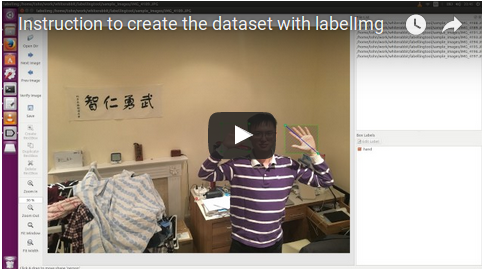
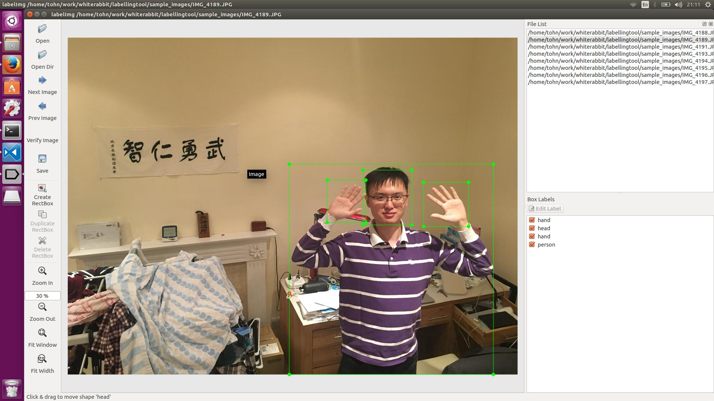
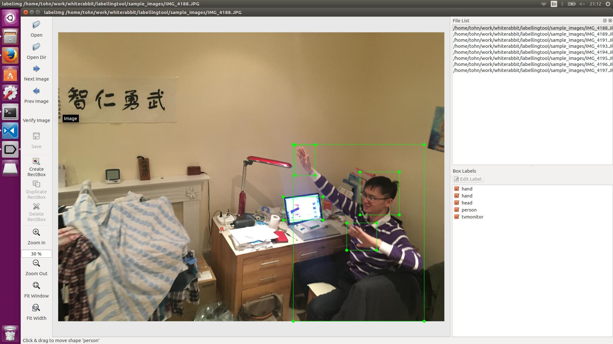
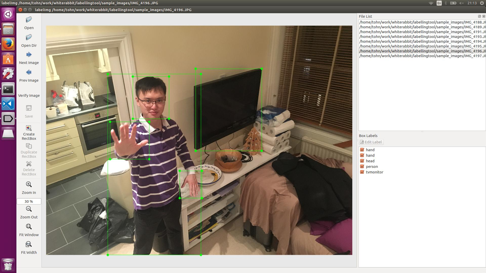

# Step to use it to generate our own dataset

* Install dependencies by in terminal running `sudo apt-get install pyqt4-dev-tools` and `sudo pip install lxml`.
* Install program by in terminal running `make all`.
* Execute the program by in terminal running `python labelImg.py`.
* Set path to save label files by in the program selecting `File> Change default saved Annotation dir` and select the folder to save the labels.
* Point to the image folder by in the program  selecting `Open Dir` and then select the image folder.
* Start labelling each image by in the program  selecting `Create RectBox`,
    * draw a bounding around an object and select its class.
    * click `Save`
* You can navigate the images by clicking `Next Image` or `Prev Image`, or double-click file name in the "File List" window.

The video for the instruction 

## example images

## You should label all of these classes when they appear in images
* head
* bicycle
* bird
* hand
* bottle
* bus
* car
* cat
* chair
* cow
* diningtable
* dog
* horse
* motorbike
* person
* pottedplant
* sheep
* sofa
* train
* tvmonitor

# LabelImg

LabelImg is a graphical image annotation tool.

It is written in Python and uses Qt for its graphical interface.

Annotations are saved as XML files in PASCAL VOC format, the format used by [ImageNet](http://www.image-net.org/).

[Watch a demo video by author tzutalin](https://youtu.be/p0nR2YsCY_U)

## Get it

### Download prebuilt binaries

* Windows
 * [Download LabelImg 1.2.2 for Windows](https://raw.githubusercontent.com/tzutalin/LabelImg/gh-pages/windows/windows_v1.2.2.zip)
 * [Download LabelImg 1.2.1 for Windows](https://raw.githubusercontent.com/tzutalin/LabelImg/gh-pages/windows/windows_v1.2.1.zip)
 * [Download LabelImg 1.2 for Windows](https://raw.githubusercontent.com/tzutalin/LabelImg/gh-pages/windows/windows_v1.2.zip)
* Linux
 * [Download LabelImg 1.2.2 for Linux](https://raw.githubusercontent.com/tzutalin/LabelImg/gh-pages/linux/linux_v1.2.2.zip)
 * [Download LabelImg 1.2.1 for Linux](https://raw.githubusercontent.com/tzutalin/LabelImg/gh-pages/linux/linux_v1.2.1.zip)
 * [Download LabelImg 1.2 for Linux](https://raw.githubusercontent.com/tzutalin/LabelImg/gh-pages/linux/linux_v1.2.zip)
* OS X
 * Binaries for OS X are not yet available. Help would be appreciated. At present it must be [built from source](#os-x).

### Build from source

Linux/Ubuntu/Mac requires at least [Python 2.6](http://www.python.org/getit/) and has been tested with [PyQt
4.8](http://www.riverbankcomputing.co.uk/software/pyqt/intro).

#### Ubuntu Linux

    sudo apt-get install pyqt4-dev-tools
    sudo pip install lxml
    make all
    ./labelImg.py

#### OS X

    brew install qt qt4
    brew install libxml2
    make all
    ./labelImg.py

#### Windows

Download and setup [Python 2.6 or later](https://www.python.org/downloads/windows/), [PyQt4](https://www.riverbankcomputing.com/software/pyqt/download) and [install lxml](http://lxml.de/installation.html).

Open cmd and go to [labelImg]

    pyrcc4 -o resources.py resources.qrc
    python labelImg.py

## Usage

### Steps

1. Build and launch using the instructions above.
2. Click 'Change default saved annotation folder' in Menu/File
3. Click 'Open Dir'
4. Click 'Create RectBox'
5. Click and release left mouse to select a region to annotate the rect box
6. You can use right mouse to drag the rect box to copy or move it

The annotation will be saved to the folder you specify.

You can refer to the below hotkeys to speed up your workflow.

### Create pre-defined classes

You can edit the [data/predefined_classes.txt](https://github.com/tzutalin/labelImg/blob/master/data/predefined_classes.txt) to load pre-defined classes

### Hotkeys

|          |                                          |
|----------|------------------------------------------|
| Ctrl + u | Load all of the images from a directory  |
| Ctrl + r | Change the default annotation target dir |
| Ctrl + s | Save                                     |
| Ctrl + d | Copy the current label and rect box      |
| Space    | Flag the current image as verified       |
| w        | Create a rect box                        |
| d        | Next image                               |
| a        | Previous image                           |
| del      | Delete the selected rect box             |
| Ctrl++   | Zoom in                                  |
| Ctrl--   | Zoom out                                 |

### How to contribute
Send a pull request

### License
[License](LICENSE.md)

### Related
1. [ImageNet Utils](https://github.com/tzutalin/ImageNet_Utils) to download image, create a label text for machine learning, etc

